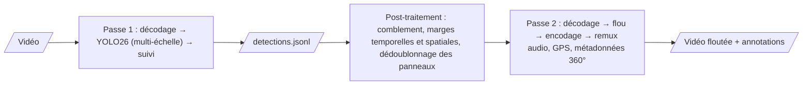

# SGBlur-Video

**Floutage des vidéos de terrain pour [Panoramax](https://panoramax.fr), au service de la vie privée.**
SGBlur-Video est l'équivalent vidéo de [SGBlur](https://gitlab.com/panoramax/server/sgblur) :
il repère les visages, les plaques d'immatriculation et les panneaux de
signalisation dans les vidéos (dashcam, vélo, piéton, 360°), **floute de façon
irréversible les visages et les plaques sur toutes les images où ils
apparaissent**, et renvoie **une annotation Panoramax par panneau physique**.

🇬🇧 [Read in English](README.md)

> **État : alpha.** Le pipeline, l'API HTTP, la 360° et les benchmarks
> fonctionnent. La vie privée est vérifiée sur des vidéos synthétiques à chaque
> push ; la validation sur de vraies vidéos annotées est en cours. Relisez le
> résultat avant de le publier, et ne l'utilisez pas encore en production.

## Pourquoi la vidéo demande plus qu'un floutage image par image

Un visage flouté sur 299 images et net sur une seule est un échec. SGBlur-Video :

- détecte sur **chaque** image, à plusieurs échelles (et par tuiles pour la 360° en 8K) ;
- **suit** les objets dans le temps (BoT-SORT) et floute les quelques images où le détecteur les a brièvement ratés ;
- privilégie la **précision** : seuls les objets détectés avec confiance sont floutés, avec des formes ajustées (la boîte la plus précise, une petite marge, une ellipse pour les visages) et un comblement court, plutôt que de grands flous au mauvais endroit ([ADR-0013](docs/adr/0013-precise-tracking.md), en anglais) ;
- utilise un flou **irréversible** (mosaïque + flou, ou aplat) ;
- **ne floute jamais les panneaux** : ils sont dédoublonnés et renvoyés comme annotations sémantiques (`osm|traffic_sign=yes`, mêmes tags que SGBlur) ;
- ne conserve aucune vidéo originale après le traitement, même en cas d'erreur.

## Fonctionnement



Détails (en anglais) : [architecture](docs/design/architecture.md),
[pipeline](docs/design/pipeline.md), [décisions](docs/adr/README.md).

## Démarrage (développement)

Prérequis : Python 3.14, [uv](https://docs.astral.sh/uv/), macOS (Apple Silicon)
ou Linux. FFmpeg n'est pas nécessaire (PyAV embarque le sien). Lancez les
commandes depuis la racine du dépôt : les chemins par défaut sont relatifs.

```bash
git clone https://github.com/KylianAUBRY/SGBlur_Video.git
cd SGBlur_Video
uv sync
uv run sgblur-video models download yolo26s          # modèle YOLO26 de SGBlur (20 Mo), empreinte vérifiée
uv run sgblur-video blur ma-video.mp4 floutee.mp4 --debug
```

`floutee.mp4` est floutée sur toutes les images, avec le son, le GPS GoPro et
les métadonnées 360° conservés. `floutee.metadata.json` contient une annotation
Panoramax par panneau, et `floutee.debug.mp4` montre chaque zone floutée et
chaque panneau. Ajoutez `--frames-dir images/` pour obtenir la meilleure vue de
chaque panneau en JPEG flouté.

Sur macOS, si le projet est dans un dossier synchronisé par iCloud (Bureau,
Documents), lisez la [FAQ](docs/guides/troubleshooting.md).

### En service

`uv run sgblur-video serve` (ou le fichier Compose ci-dessous), puis ouvrez
<http://localhost:8000/ui> pour flouter une vidéo depuis le navigateur, ou utilisez l'API :

```bash
docker compose -f docker/docker-compose.yml up --build       # ou : uv run sgblur-video serve
curl -s -F video=@ma-video.mp4 http://localhost:8000/blur/   # → {"job_id": …}
curl -s http://localhost:8000/jobs/<job_id>                   # avancement
curl -s -o floutee.mp4 http://localhost:8000/jobs/<job_id>/video
```

Voir [l'API HTTP](docs/usage/api.md).

## Feuille de route

Les étapes 1 à 9 de la v1 sont faites (analyse, conception, squelette, pipeline,
panneaux, API et Docker, 360° et télémétrie, benchmarks, relecture de la
documentation) ; le détail est dans le [README anglais](README.md#roadmap).
La v1 est développée pendant un hackathon, en temps limité. Sont prévus pour la
**v2** : le signalement privé de vulnérabilités (GitHub), la conservation des
télémétries CAMM, DJI et Insta360, les formats 360° bruts (GoPro `.360`,
Insta360 `.insv`), la route de dé-floutage des zones `keep=1` et un
classifieur du type de panneau.

## Modèle

SGBlur-Video utilise le modèle de détection publié par SGBlur
(`yolo26s_panoramax.pt`, classes `direction`, `sign`, `plate`, `face`). Les
poids sont téléchargés depuis une URL figée et vérifiés par SHA-256 ; ils ne
sont pas stockés dans ce dépôt. Voir [models/registry.yaml](models/registry.yaml).

## Documentation

La documentation (en anglais) est dans [`docs/`](docs/index.md) et publiée sur
<https://kylianaubry.github.io/SGBlur_Video/> : installation, utilisation,
vie privée, benchmarks, architecture, contrat d'API, configuration, décisions (ADR).

## Licence

Le code de ce dépôt est sous [licence MIT](LICENSE). Il s'appuie à l'exécution
sur [Ultralytics](https://github.com/ultralytics/ultralytics), sous licence
AGPL-3.0 : déployer le service avec cette dépendance est soumis aux conditions
de cette licence. Voir [docs/license.md](docs/license.md) et
[THIRD_PARTY_LICENSES.md](THIRD_PARTY_LICENSES.md).

## Contribuer

Les contributions sont bienvenues : lisez [CONTRIBUTING.md](CONTRIBUTING.md) (en
anglais) et le [code de conduite](CODE_OF_CONDUCT.md). Une **fuite de vie
privée** (visage ou plaque resté visible) se signale avec le modèle de ticket
dédié, **sans aucune image ni détail permettant d'identifier qui que ce soit** :
voir [SECURITY.md](SECURITY.md). Le signalement privé est prévu pour la v2.

## Remerciements

Ce projet s'appuie sur le travail de l'équipe Panoramax, en particulier SGBlur
de Christian Quest, ainsi que le backend et la sémantique Panoramax d'Antoine
Desbordes et des contributeurs.
