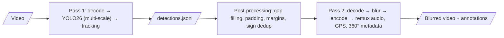

# SGBlur-Video

**Privacy blurring of street-level videos for [Panoramax](https://panoramax.fr).**
SGBlur-Video is the video counterpart of [SGBlur](https://gitlab.com/panoramax/server/sgblur):
it finds faces, licence plates and traffic signs in dashcam, bike, pedestrian and
360° videos, **irreversibly blurs faces and plates on every frame where they appear**,
and returns **one Panoramax annotation per physical traffic sign**.

🇫🇷 [Lire en français](README.fr.md)

> **Status: pre-alpha.** The design is done and the project skeleton is in place;
> the processing pipeline is being implemented. Nothing here is ready for
> production yet. Follow the roadmap below.

## Why video needs more than per-frame blurring

A face blurred on 299 frames and visible on one frame is a privacy failure.
SGBlur-Video therefore:

- detects on **every** frame, at several scales (and in tiles for 8K 360° footage);
- **tracks** objects over time and blurs the frames where the detector missed them (gap interpolation);
- blurs a few frames **before and after** each track, with a safety margin around every box;
- blurs **untracked low-score detections** too: recall beats precision;
- uses an **irreversible** blur (mosaic + blur, or solid fill), never a light Gaussian;
- **never blurs traffic signs**: they are deduplicated per physical sign and returned as semantic annotations (`osm|traffic_sign=yes`, same tags as SGBlur);
- keeps no original video once processing ends, even on failure.

## How it works



Details: [architecture](docs/design/architecture.md), [pipeline](docs/design/pipeline.md),
[decision records](docs/adr/README.md).

## Quick start (development)

Requirements: Python 3.14, [uv](https://docs.astral.sh/uv/), macOS (Apple Silicon) or Linux.

```bash
git clone https://github.com/KylianAUBRY/SGBlur_Video.git
cd SGBlur_Video
uv sync
uv run sgblur-video models download                  # SGBlur YOLO26 model, hash-checked
uv run sgblur-video blur my-video.mp4 blurred.mp4 --debug
```

`blurred.metadata.json` holds one Panoramax annotation per traffic sign and
`blurred.debug.mp4` shows every blurred region and every sign. Add
`--frames-dir frames/` to get the best view of each sign as a blurred JPEG.

### As a service

```bash
docker compose -f docker/docker-compose.yml up --build       # or: uv run sgblur-video serve
curl -s -F video=@my-video.mp4 http://localhost:8000/blur/   # → {"job_id": …}
curl -s http://localhost:8000/jobs/<job_id>                   # progress
curl -s -o blurred.mp4 http://localhost:8000/jobs/<job_id>/video
```

See [HTTP API](docs/usage/api.md).

## Roadmap

| Step | Content | Status |
|---|---|---|
| 1 | Analysis of SGBlur, Panoramax and Ultralytics | ✅ done |
| 2 | Design: architecture, API contract, ADRs | ✅ done |
| 3 | Project skeleton, configuration, CI, docs structure | ✅ done |
| 4 | Core pipeline as a CLI, with tests | ✅ done |
| 5 | Traffic signs: deduplication, annotations, best frames | ✅ done |
| 6 | Asynchronous HTTP API, Docker | ✅ done |
| 7 | 360° seam handling, telemetry, metadata preservation | ⏳ next |
| 8 | Benchmarks (trackers, models, devices) and default tuning | |
| 9 | Documentation review | |

v1 is built during a time-limited hackathon. Deliberately left for **v2**:
private vulnerability reporting (GitHub), CAMM/DJI/Insta360 telemetry
preservation, raw 360° formats (GoPro `.360`, Insta360 `.insv`), the un-blur
route for `keep=1` regions, and a second-stage sign classifier.

## Model

SGBlur-Video uses the detection model published by SGBlur
(`yolo26s_panoramax.pt`, classes `direction`, `sign`, `plate`, `face`). Weights
are downloaded from a pinned URL and verified by SHA-256; they are not stored in
this repository. See [models/registry.yaml](models/registry.yaml).

## Licence

The code of this repository is released under the [MIT licence](LICENSE).
It depends at runtime on [Ultralytics](https://github.com/ultralytics/ultralytics),
which is licensed under AGPL-3.0: deploying the service with it is subject to
that licence's conditions. Read [docs/license.md](docs/license.md) and
[THIRD_PARTY_LICENSES.md](THIRD_PARTY_LICENSES.md) before deploying.

## Contributing

Contributions are welcome: read [CONTRIBUTING.md](CONTRIBUTING.md) and the
[code of conduct](CODE_OF_CONDUCT.md). **Privacy leaks** (a face or plate left
visible) are reported with the dedicated issue template, **never with images or
identifying details**: see [SECURITY.md](SECURITY.md).

## Acknowledgements

Built on the work of the Panoramax team, especially SGBlur by Christian Quest and
the Panoramax backend and semantics by Antoine Desbordes and contributors.
