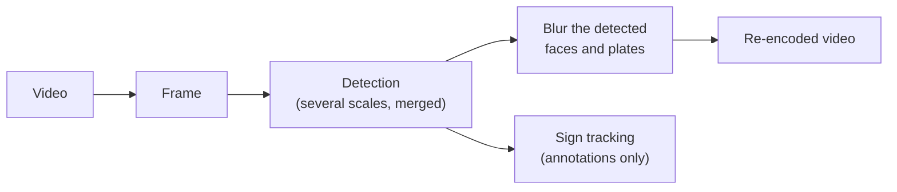

# Frame-by-frame blurring

SGBlur-Video blurs a video the way SGBlur blurs pictures: it cuts the video
into frames, treats **each frame as an independent picture**, and puts the
blurred frames back together (with the sound, the GPS track and the 360°
metadata). What is blurred on a frame depends only on what the model detected
on that frame ([ADR-0012](../adr/0012-independent-frames.md)).



## 1. What is blurred on a frame

On every frame, exactly like SGBlur on a picture:

- the model runs at several scales (`1024`, `2048`, and native-resolution
  tiles on 8K 360° frames), and boxes found by several passes are merged,
  keeping the **smallest** of the duplicates;
- every face and plate detected with a score of at least `CONF_DETECT` (0.30,
  SGBlur's value) is blurred with a **rectangle exactly on its box**;
- boxes smaller than 12 pixels on a side are skipped (nothing identifiable
  fits in them).

Nothing is carried from one frame to the next: no tracking, no interpolation
between two detections, no padding before or after an object.

## 2. What it means

- **Predictable output.** Every blurred rectangle is a detection of that frame:
  the debug video labels each one with its class and score.
- **No dependence on the frame rate.** A timelapse stored at 30 fps but
  captured at 2 frames per second is blurred exactly like a normal video.
- **A miss shows.** A face or plate the model misses on one frame stays visible
  on that frame, as on a picture blurred by SGBlur. On a normal 30 fps video,
  it can appear unblurred for a few frames while it turns away, is motion
  blurred or is still too small. The privacy benchmark on annotated clips
  measures how often and for how long
  ([benchmarks](../guides/benchmarks.md)).
- **Tight boxes.** The blur covers the detected box and no more: if the model's
  box is slightly smaller than the object, its edges stay visible (as with
  SGBlur).

## 3. Signs

Signs and direction signs are **never blurred**. They are the only objects
that are tracked across frames, to produce **one** Panoramax annotation per
physical sign instead of one per frame: see
[Annotations and Panoramax](annotations.md). The sign tracker
(`TRACKER_CONFIG`, optical flow by default) never changes what is blurred.

## 4. 360° video

On equirectangular video, detection inputs are padded with the opposite edge
so that an object straddling the 0°/360° seam is seen whole; a box that
crosses the seam is blurred on both edges of the frame.

## Checking it on your videos

```bash
uv run sgblur-video blur input.mp4 output.mp4 --debug
```

writes `output.debug.mp4`, the **blurred** video with every blurred box
outlined (the web page does the same with its *Debug video* option, the API
with `debug=1`):

- the colour is the class: magenta = face, yellow = plate (blurred), blue =
  sign, cyan = direction sign (kept);
- every outline is a detection of that frame, labelled with its class and
  score; signs also show their track number.
