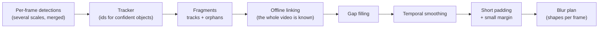

# Tracking and post-processing

A video is not a pile of independent pictures: a face that is detected on 299
frames and missed on one is still visible on that one frame. This page explains
how SGBlur-Video follows faces and plates over time to cover such short misses,
while favouring **precision**: it is better to miss a difficult detection than
to blur the wrong place ([ADR-0013](../adr/0013-precise-tracking.md)).



## 1. Why per-frame detection is not enough

Detectors miss objects regularly: motion blur, a face turning away, a plate
seen at a grazing angle, compression artefacts, or simply an object too small.
On real 8K 360° footage, distant faces and plates are often detected only every
other frame. Each miss would be a frame where the object stays visible.

## 2. Tracks, orphans and fragments

The model only reports boxes with a score of at least `CONF_DETECT` (0.30).
The tracker gives the same identifier to detections of the same object across
frames. The default one is **BoT-SORT** (`configs/trackers/botsort.yaml`), set
for precision: a new track needs a detection scoring at least 0.5, weaker
detections only extend an existing track, and a lost track is forgotten after
half a second. The optical-flow tracker (`configs/trackers/flow.yaml`) and the
other Ultralytics trackers remain available with `TRACKER_CONFIG`. Detections
the tracker leaves without an id are *orphans*. Every track and every orphan
becomes a *fragment*.

## 3. Offline linking

Because blurring happens in a second pass, the whole video is already known.
Fragments of the same kind of object are chained when one starts shortly
after another ends (up to `LINK_MAX_GAP_S`, 0.5 s) close to where the previous
one was heading. A plate seen on frames 0, 2, 4, 6… becomes one chain instead
of dozens of isolated sightings. See [ADR-0011](../adr/0011-offline-linking.md).

A chain is blurred if it contains at least one detection with a score of at
least `CONF_BLUR` (0.40) — so a face that scores 0.6 when facing the camera is
also blurred when it turns away and only scores 0.35. An object only ever seen
below 0.40 is **not** blurred: it is more often a poster or a reflection than a
face.

## 4. Gap filling

Between two sightings of a chain, every missing frame receives a box linearly
interpolated between the two known boxes, but only over short gaps
(`MAX_INTERPOLATION_GAP_S`, 0.3 s) and short moves (`MAX_INTERPOLATION_JUMP`,
5 box sizes): beyond that, the object may have left, or two objects were tracked
as one, and the blur would land where nothing is.

```
frame        10   11   12   13   14   15   16
detected     ███  ·    ·    ·    ███  ███  ███     · = missed by the detector
blurred      ███  ▒▒▒  ▒▒▒  ▒▒▒  ███  ███  ███     ▒ = interpolated box
```

## 5. Temporal smoothing

Detector boxes jitter from frame to frame. A true 5-frame moving average
smooths them: the box keeps the size of the object. Boxes are never merged
into a larger box: when the detector sees an object in several passes, the
most precise box is kept (the pass that saw it at the highest resolution).

## 6. Short padding and small margin

Detectors usually pick an object up a frame or two after it becomes visible
and lose it a frame or two before it leaves. Every chain is extended by
`BLUR_TEMPORAL_PADDING_FRAMES` (3 frames = 0.1 s at 30 fps) before its first
and after its last sighting; the padded box follows the object's motion when
at least 3 sightings measure it, and grows by `BLUR_PADDING_GROWTH` (2 %) per
frame. Longer padding blurred mostly empty places on 8K street video.

```
frame          0    5    10   15   20   25   30
sightings                ███████████████
padding (3)           ◄──┤             ├──►
blurred               ▓▓▓▓▓▓▓▓▓▓▓▓▓▓▓▓▓▓▓▓▓
```

Every box is finally enlarged by `BLUR_BOX_MARGIN` (5 % per side). Faces are
blurred with the **ellipse inscribed** in that box (a face is oval; the corners
of its box are background), plates with the box itself. Segmentation masks or
oriented boxes would fit even better, but need a segmentation or OBB model:
the available weights only detect boxes.

## 7. Signs

Signs and direction signs are tracked the same way but **never blurred**. They
are deduplicated into one Panoramax annotation per physical sign: see
[Annotations and Panoramax](annotations.md).

## 8. Known limitations

- An object the detector **never** sees with a score of at least 0.40 is not
  blurred: tracking only fills short gaps between confident sightings. Very
  small faces (≈ 15 px) in 8K 360° footage are the main known case. The
  thresholds will be tuned with the privacy benchmark on annotated clips
  ([benchmarks](../guides/benchmarks.md)).
- A miss longer than 0.3 s, or more than 3 frames before the first or after
  the last detection, leaves the object visible on those frames.
- A detector box slightly tighter than the object can leave its edges visible
  (5 % margin).
- Durations (interpolation, linking, track retention) are converted with the
  file's frame rate: on a timelapse stored at 30 fps but captured at 2 frames
  per second, they cover 15 times more real time.
- On 360° video, objects crossing the 0°/360° seam are followed around the
  circle and blurred on both edges; objects near the poles rely on the
  `thorough` detection profile.

## Checking it on your videos

```bash
uv run sgblur-video blur input.mp4 output.mp4 --debug
```

writes `output.debug.mp4`, the **blurred** video with every shape outlined
(the web page does the same with its *Debug video* option, the API with
`debug=1`):

- the colour is the class: magenta = face, yellow = plate (blurred), blue =
  sign, cyan = direction sign (kept);
- a **solid** outline is a detection of that frame, labelled with its class,
  score and track number;
- a **dashed** outline, without label, is blurred although the model found
  nothing on that frame: interpolated between two detections of the track, or
  padded before its first or after its last detection (the box grows a little
  every frame, and follows the object's motion when at least 3 detections
  measure it).
