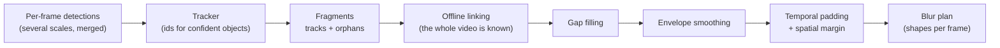

# Tracking and post-processing

A video is not a pile of independent pictures: a face that is detected on 299
frames and missed on one is still visible on that one frame. This page explains
how SGBlur-Video turns imperfect per-frame detections into a blur that covers
**every** frame where a face or a plate is present.



## 1. Why per-frame detection is not enough

Detectors miss objects regularly: motion blur, a face turning away, a plate
seen at a grazing angle, compression artefacts, or simply an object too small.
On real 8K 360° footage, distant faces and plates are often detected only every
other frame. Each miss would be a frame where the object stays visible.

## 2. Tracks, orphans and fragments

The Ultralytics tracker (TrackTrack by default) gives the same identifier to
detections of the same object across frames. It only follows objects it is
confident about: low-score or intermittent detections are left without an id.
Those **orphans are never discarded**. Every track and every orphan becomes a
*fragment*.

## 3. Offline linking

Because blurring happens in a second pass, the whole video is already known.
Fragments of the same kind of object are chained when one starts shortly
after another ends (up to `LINK_MAX_GAP_S`, 1 s) close to where the previous
one was heading. A plate seen on frames 0, 2, 4, 6… becomes one chain instead
of dozens of isolated sightings. Wrongly linking two objects only merges their
blur regions; it never removes blur. See [ADR-0011](../adr/0011-offline-linking.md).

A chain is blurred if it contains at least one detection with a score of at
least `CONF_BLUR` — so a face that scores 0.6 when facing the camera is also
blurred when it turns away and only scores 0.12.

## 4. Gap filling

Between two sightings of a chain, every missing frame receives a box linearly
interpolated between the two known boxes (up to `MAX_INTERPOLATION_GAP_S`, 2 s).

```
frame        10   11   12   13   14   15   16
detected     ███  ·    ·    ·    ███  ███  ███     · = missed by the detector
blurred      ███  ▒▒▒  ▒▒▒  ▒▒▒  ███  ███  ███     ▒ = interpolated box
```

## 5. Envelope smoothing

Detector boxes jitter from frame to frame. A 5-frame moving average smooths
them, and the final box is the **union** of the smoothed and the original box:
smoothing can enlarge a box, never shrink it.

## 6. Temporal padding and spatial margin

Detectors usually pick an object up a few frames after it becomes visible and
lose it a few frames before it leaves. Every chain is therefore extended by
`BLUR_TEMPORAL_PADDING_FRAMES` (15 frames ≈ 0.5 s at 30 fps) before its first
and after its last sighting. The padded boxes follow the chain's velocity and
grow by `BLUR_PADDING_GROWTH` (5 %) per frame to absorb the uncertainty.

```
frame          0    5    10   15   20   25   30   35   40   45
sightings                     ███████████████
padding (15)   ◄──────────────┤             ├──────────────►
blurred        ▓▓▓▓▓▓▓▓▓▓▓▓▓▓▓▓▓▓▓▓▓▓▓▓▓▓▓▓▓▓▓▓▓▓▓▓▓▓▓▓▓▓▓
```

Every box is finally enlarged by `BLUR_BOX_MARGIN` (15 % per side). Faces are
blurred with the ellipse that passes through the corners of that box (an
ellipse inscribed in the box would leave its corners visible), plates with
the box itself.

## 7. Signs

Signs and direction signs are tracked the same way but **never blurred**. They
are deduplicated into one Panoramax annotation per physical sign (roadmap
step 5).

## 8. Known limitations

- An object the detector **never** sees cannot be blurred: tracking and
  post-processing only fill gaps between sightings. Very small faces (≈ 15 px)
  in 8K 360° footage are the main known case; the detection profile and
  thresholds are tuned against annotated clips in step 8.
- Padding uses a constant-velocity model: an object that changes direction
  abruptly at the very start or end of its appearance relies on the growing
  padded box to stay covered.
- Padding follows the predicted path of an object that just left the field of
  view, so it can blur a few frames of whatever lies on that path — sometimes
  part of a sign. This over-blurring is accepted by design (privacy first); the
  sign itself is still annotated from its other frames.
- The 0°/360° seam of equirectangular videos is handled in step 7.

## Checking it on your videos

```bash
uv run sgblur-video blur input.mp4 output.mp4 --debug
```

writes `output.debug.mp4`, the **blurred** video with every shape outlined:
green = detected, yellow = interpolated, orange = padded, magenta = isolated
sighting, blue = sign (not blurred).
