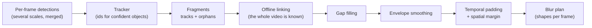

# Tracking and post-processing

A video is not a pile of independent pictures: a face that is detected on 299
frames and missed on one is still visible on that one frame. This page explains
how SGBlur-Video turns imperfect per-frame detections into a blur that covers
**every** frame where a face or a plate is present.



## 1. Why per-frame detection is not enough

Detectors miss objects regularly: motion blur, a face turning away, a plate
seen at a grazing angle, compression artefacts, or simply an object too small.
On real 8K 360° footage, distant faces and plates are often detected only every
other frame. Each miss would be a frame where the object stays visible.

## 2. Tracks, orphans and fragments

The tracker gives the same identifier to detections of the same object across
frames. The default one (`configs/trackers/flow.yaml`) moves each track's box
with the **optical flow** of the image around it, then matches it to the
nearest detection: a plate parked a few metres from a car moves more than its
own width between two frames of 8K 360° video, so trackers that match boxes by
overlap lost almost every plate (261 of 265 plate detections untracked on a
parking-lot sample) and each plate became a dozen fragments. The Ultralytics
trackers (TrackTrack, BoT-SORT, ByteTrack) remain available with
`TRACKER_CONFIG`; they leave low-score or intermittent detections without an
id. Those **orphans are never discarded**. Every track and every orphan becomes
a *fragment*.

## 3. Offline linking

Because blurring happens in a second pass, the whole video is already known.
Fragments of the same kind of object are chained when one starts shortly
after another ends (up to `LINK_MAX_GAP_S`, 1 s) close to where the previous
one was heading. A plate seen on frames 0, 2, 4, 6… becomes one chain instead
of dozens of isolated sightings. Wrongly linking two objects only merges their
blur regions; it never removes blur. See [ADR-0011](../adr/0011-offline-linking.md).

A chain is blurred if it contains at least one detection with a score of at
least `CONF_BLUR` — so a face that scores 0.6 when facing the camera is also
blurred when it turns away and only scores 0.12.

## 4. Gap filling

Between two sightings of a chain, every missing frame receives a box linearly
interpolated between the two known boxes (up to `MAX_INTERPOLATION_GAP_S`, 2 s).
Two sightings more than `MAX_INTERPOLATION_JUMP` (20 box sizes) apart are not
interpolated: they are two objects tracked as one, and the blur would sweep
across the frame between them.

```
frame        10   11   12   13   14   15   16
detected     ███  ·    ·    ·    ███  ███  ███     · = missed by the detector
blurred      ███  ▒▒▒  ▒▒▒  ▒▒▒  ███  ███  ███     ▒ = interpolated box
```

## 5. Envelope smoothing

Detector boxes jitter from frame to frame. A 5-frame moving average smooths
them, and the final box is the **union** of the smoothed and the original box:
smoothing can enlarge a box, never shrink it.

## 6. Temporal padding and spatial margin

Detectors usually pick an object up a few frames after it becomes visible and
lose it a few frames before it leaves. Every chain is therefore extended by
`BLUR_TEMPORAL_PADDING_FRAMES` (12 frames = 0.4 s at 30 fps) before its first
and after its last sighting. The padded boxes grow by `BLUR_PADDING_GROWTH` (5 %)
per frame to absorb the uncertainty, and their centre follows the chain's
velocity when at least 3 sightings measure it, at most half a box size per
frame. Two sightings of an intermittently detected plate (or of two plates
linked together) give a meaningless velocity: on 8K street video it sent
padded boxes into the sky, away from the plate. The box size does not follow
the chain: the plate of an approaching car grows fast, and following that
growth made padded boxes several times larger than the plate.

On busy streets the tracker rarely follows small plates, so each plate becomes
many short chains, each padded on both sides. To blur less around them, lower
`BLUR_TEMPORAL_PADDING_FRAMES` (e.g. `8`): on a 38-frame parking-lot sample of
8K 360° video it divided the blurred plate area by 2, and every plate detected
with a score ≥ 0.3 stayed blurred. Check the leakage on your own footage
([benchmarks](../guides/benchmarks.md)) before lowering it in production.

```
frame          0    5    10   15   20   25   30   35   40   45
sightings                     ███████████████
padding (12)   ◄──────────────┤             ├──────────────►
blurred        ▓▓▓▓▓▓▓▓▓▓▓▓▓▓▓▓▓▓▓▓▓▓▓▓▓▓▓▓▓▓▓▓▓▓▓▓▓▓▓▓▓▓▓
```

Every box is finally enlarged by `BLUR_BOX_MARGIN` (10 % per side). Faces are
blurred with the ellipse that passes through the corners of that box (an
ellipse inscribed in the box would leave its corners visible), plates with
the box itself.

## 7. Signs

Signs and direction signs are tracked the same way but **never blurred**. They
are deduplicated into one Panoramax annotation per physical sign: see
[Annotations and Panoramax](annotations.md).

## 8. Known limitations

- An object the detector **never** sees cannot be blurred: tracking and
  post-processing only fill gaps between sightings. Very small faces (≈ 15 px)
  in 8K 360° footage are the main known case. The detection profile and
  thresholds will be tuned with the privacy benchmark on annotated clips
  ([benchmarks](../guides/benchmarks.md)).
- Padding uses a constant-velocity model: an object that changes direction
  abruptly at the very start or end of its appearance relies on the growing
  padded box to stay covered.
- Padding follows the predicted path of an object that just left the field of
  view, so it can blur a few frames of whatever lies on that path — sometimes
  part of a sign. This over-blurring is accepted by design (privacy first); the
  sign itself is still annotated from its other frames.
- On 360° video, objects crossing the 0°/360° seam are followed around the
  circle and blurred on both edges; padding near the poles relies on the
  `thorough` detection profile for objects above or below the middle band.

## Checking it on your videos

```bash
uv run sgblur-video blur input.mp4 output.mp4 --debug
```

writes `output.debug.mp4`, the **blurred** video with every shape outlined
(the web page does the same with its *Debug video* option, the API with
`debug=1`):

- the colour is the class: magenta = face, yellow = plate (blurred), blue =
  sign, cyan = direction sign (kept);
- a **solid** outline is a detection of that frame, labelled with its class,
  score and track number;
- a **dashed** outline, without label, is blurred although the model found
  nothing on that frame: interpolated between two detections of the track, or
  padded before its first or after its last detection (the box grows a little
  every frame, and follows the object's motion when at least 3 detections
  measure it).
