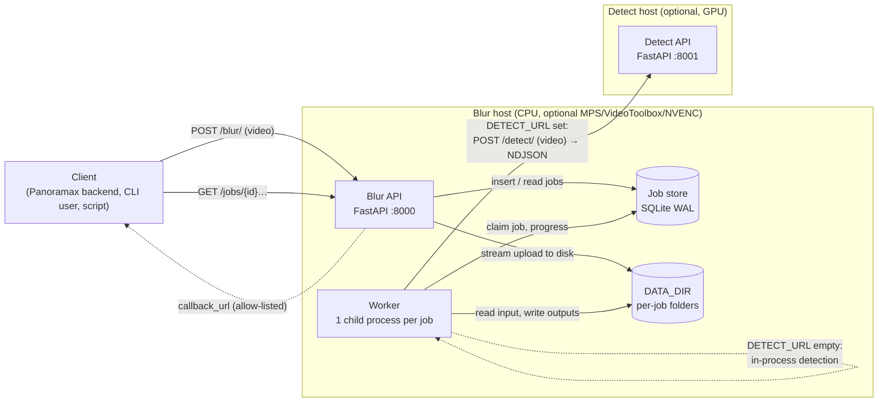
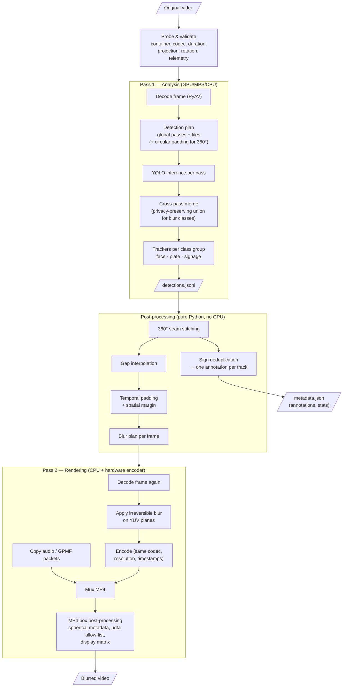
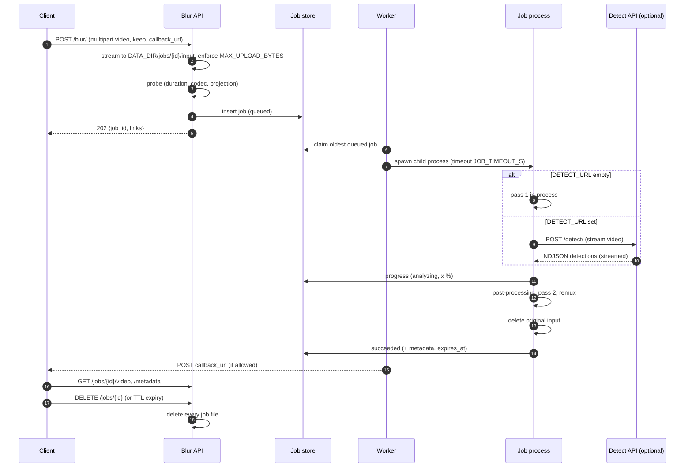
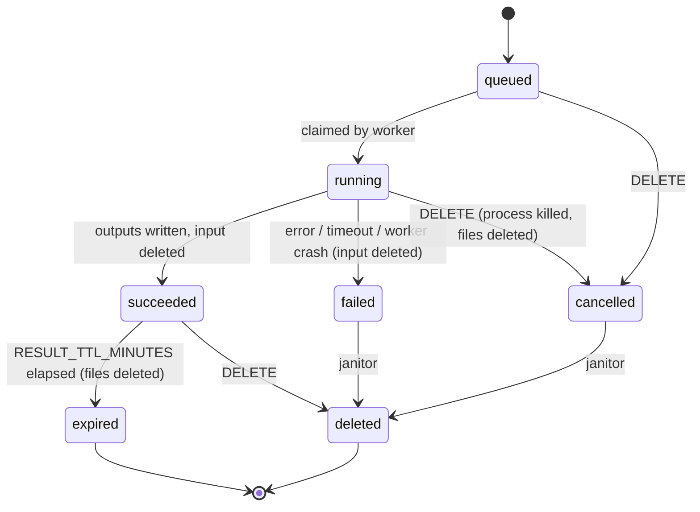

# Architecture

> Status: **draft for validation (step 2)**. Decisions referenced here are recorded
> in [`docs/adr/`](../adr/README.md). Measurements come from spikes run on
> 2026-10-06 on an Apple M4 Pro (see [§ Performance budget](#performance-budget)).

## Goals in one paragraph

`sgblur-video` receives a video (flat or 360° equirectangular), finds faces,
licence plates and traffic signs on **every** frame, follows them over time, and
returns a re-encoded video where faces and plates are irreversibly blurred on
every frame where they are present, plus Panoramax-compatible annotations with
**one annotation per physical sign**. Privacy wins every trade-off: blurring a
bit too much is acceptable, leaving one frame unblurred is not.

## Components



| Component | Module | Role |
|---|---|---|
| Blur API | `sgblur_video.api.blur_api` | Accepts uploads (streamed to disk), validates them, creates jobs, serves status, results and metrics. Never runs inference. |
| Worker | `sgblur_video.jobs.worker` | Claims queued jobs and runs each one in a fresh child process: analysis, post-processing, rendering, remux, cleanup. |
| Detect API | `sgblur_video.api.detect_api` | Optional remote analysis service: video in, `detections.jsonl` out (streamed). Same code as the in-process path. |
| Job store | `sgblur_video.jobs.store` | SQLite database (WAL mode) holding job rows, progress and timings. No video data. |
| CLI | `sgblur_video.cli` | `blur`, `detect`, `render`, `signs`, `worker`, `serve`, `annotate`, `benchmark`. Uses the same pipeline without any server. |

### Deployment modes

| Mode | When | How |
|---|---|---|
| **Native single host** | Development, macOS (MPS + VideoToolbox are not reachable from Docker on macOS) | `sgblur-video serve` (API + one worker) |
| **Docker all-in-one** | Default `docker compose up` | `api` + `worker` containers sharing a volume; detection in-process (CPU or NVIDIA GPU image) |
| **Split** | Detection on a remote GPU machine | Same as above plus a `detect` container on the GPU host and `DETECT_URL` set on the worker |

## Processing pipeline (two passes)



Why two passes ([ADR-0001](../adr/0001-two-pass-architecture.md)):
tracks are only complete once the whole video has been seen. Gap filling
needs the *next* observation, and temporal padding before a track starts needs
to know where it starts. A single streaming pass could only pad backwards with
a frame buffer. The intermediate `detections.jsonl` file also lets us re-render
without re-detecting, debug a job offline, and unit-test post-processing on CPU.

Details of each stage are in [pipeline.md](pipeline.md); the intermediate file
format is in [detections-format.md](detections-format.md).

## Lifecycle of a job





`running` carries a `phase`: `analyzing` → `postprocessing` → `rendering` → `finalizing`.

## Data retention (privacy)

| Data | Where | Deleted when |
|---|---|---|
| Original upload | `DATA_DIR/jobs/{id}/input.*` | As soon as rendering finishes, on any failure, on cancel. Startup janitor removes leftovers of crashed workers. |
| `detections.jsonl` (box coordinates, no pixels) | job folder | With the job (result TTL or `DELETE`). |
| Blurred video, metadata, best frames | job folder | `RESULT_TTL_MINUTES` after success (default 60) or `DELETE`. |
| `keep=1` regions (original pixels of low-confidence blurred areas) | `KEEP_DIR`, AES-256-GCM encrypted | `KEEP_TTL_HOURS` (default 48). Requires `KEEP_SECRET_KEY`. |
| Job row (ids, timings, counters, error codes) | SQLite | 24 h after the job leaves `succeeded`/`failed`. Contains no file names, no user data. |
| Logs | stdout | Job id, phase, counts, timings only. Never file names, paths from uploads, thumbnails or coordinates. |

## Performance budget

Measured on Apple M4 Pro, `ultralytics 8.4.173`, `torch 2.14.1` (MPS), PyAV 19.0.1 (FFmpeg 9.0.2), model `yolo26s_panoramax.pt`:

| Operation | 8K equirect (7680×3840, HEVC 10-bit) | 1080p GoPro (HEVC) |
|---|---|---|
| Decode + convert to RGB | ~50 fps (software ≥ VideoToolbox) | ~1200 fps |
| YOLO, full frame, `imgsz=1024` | 12 ms | — |
| YOLO, full frame, `imgsz=2048` | 38 ms | — |
| YOLO, half middle band at native res (`imgsz=3840`) | 145 ms × 2 halves | — |
| YOLO on CPU, `imgsz=1024` | 46 ms | — |
| Encode HEVC 10-bit, VideoToolbox | 14.7 fps | — |
| Encode HEVC 10-bit, libx265 `medium` / `veryfast` | 1.2 / 2.3 fps | — |

End-to-end pipeline measured in step 4 on the same machine (8K equirect,
`DETECT_PROFILE=standard`, 4 passes per frame): **analysis ≈ 0.4 s/frame**
(2.5 fps), **rendering ≈ 14.5 fps** (encoder-bound, debug video included).
1080p GoPro: analysis ≈ 11 fps (2 passes), rendering ≈ 85 fps.

Consequences:

- An 8K 360° clip of 96 s (2893 frames) needs ≈ 16 min of analysis plus ≈ 3.5 min of encoding natively on this machine (≈ 0.05× real time). Detection, not decoding, dominates.
- Without a hardware encoder (Docker on macOS, CPU-only Linux) 8K encoding alone takes 20–40 min for the same clip. Documented as a known limitation; CPU mode targets ≤ 4K.
- Throughput levers, in order: drop the tile pass (`DETECT_PROFILE=fast`), TensorRT/CoreML export, NVENC. They are evaluated in step 8.

## Technology choices

| Concern | Choice | Reference |
|---|---|---|
| Language/runtime | Python 3.14 (`requires-python >= 3.14`) | Newest CPython with wheels for torch 2.14, PyAV 19, OpenCV 5 (checked) |
| Detection & tracking | `ultralytics` (pinned exactly), tracker classes used directly | [ADR-0002](../adr/0002-own-detection-loop-with-ultralytics-trackers.md), [ADR-0003](../adr/0003-default-tracker.md) |
| Model | SGBlur `yolo26s_panoramax.pt`, downloaded and hash-checked, never committed | [ADR-0009](../adr/0009-model-registry-and-class-policy.md) |
| Video I/O | PyAV for decode/encode/mux, custom MP4 box editor | [ADR-0008](../adr/0008-video-io-and-metadata-preservation.md) |
| Jobs | SQLite + worker processes, no Redis | [ADR-0005](../adr/0005-job-queue.md) |
| API | FastAPI + Uvicorn, two apps (blur, detect) as in SGBlur | [api.md](api.md) |
| Config | `pydantic-settings`, env vars without prefix (SGBlur convention) | [configuration.md](configuration.md) |
| Forge/CI | GitHub, GitHub Actions, GitHub Pages (MkDocs Material) | maintainer decision 2026-10-06 |
| Licence | MIT for this code; AGPL-3.0 runtime dependency documented | [ADR-0006](../adr/0006-licence.md) |

## Package layout (target for step 3)

```
src/sgblur_video/
├── api/          blur_api.py, detect_api.py, schemas.py, errors.py
├── core/         probe.py, decode.py, detect.py, track.py, postprocess.py,
│                 render.py, encode.py, remux.py, mp4boxes.py, pipeline.py
├── privacy/      blur.py (methods & shapes), keep.py (encrypted regions), cleanup.py
├── semantics/    annotations.py (tracks → Panoramax annotations)
├── video360/     wrap.py (wrap-around geometry across the 0°/360° seam)
├── telemetry/    gpmf.py (KLV parser), gps.py (GPS track → position at timestamp)
├── jobs/         store.py, worker.py, janitor.py
├── bench/        dataset.py, cvat.py, clips.py, annotate.py (privacy dataset),
│                 metrics.py, cache.py, runs.py, report.py (benchmarks)
├── models.py     registry loading, download, auto-selection
├── config.py
└── cli.py
configs/trackers/ tracktrack-recall.yaml, botsort-recall.yaml, bytetrack-recall.yaml
models/           registry.yaml (no weights in git)
```
