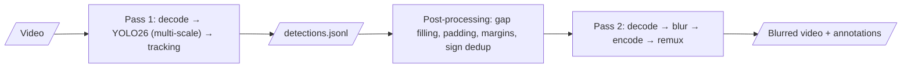

# SGBlur-Video

**Privacy blurring of street-level videos for [Panoramax](https://panoramax.fr).**

SGBlur-Video is the video counterpart of
[SGBlur](https://gitlab.com/panoramax/server/sgblur). It finds faces, licence
plates and traffic signs in dashcam, bike, pedestrian and 360° videos,
**irreversibly blurs faces and plates on every frame where they appear**, and
returns **one Panoramax annotation per physical traffic sign**.

!!! warning "Pre-alpha"
    The design is complete and the project skeleton is in place. The processing
    pipeline is being implemented (roadmap step 4). Pages marked *planned* are
    placeholders that will be written with the corresponding step.

## Where to start

| You want to… | Read |
|---|---|
| Understand the design | [Architecture](design/architecture.md), [Pipeline](design/pipeline.md), [ADRs](adr/README.md) |
| Configure the service | [Configuration reference](reference/configuration.md) |
| Integrate with Panoramax | [HTTP API contract](design/api.md), [Annotations](concepts/annotations.md) |
| Know what happens to personal data | [Privacy and GDPR](concepts/privacy.md) |
| Contribute | [CONTRIBUTING.md](https://github.com/KylianAUBRY/SGBlur_Video/blob/main/CONTRIBUTING.md) |
